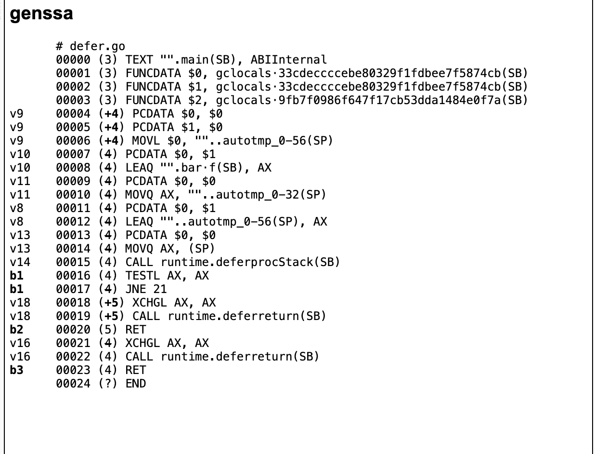
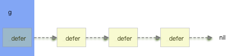

[TOC]

# go源码学习之 Defer （上）

(本文写于2020-05, Golang 最新版本为1.14.2。上篇主要内容讨论了defer的实现原理。优化的思路。下篇主要讨论与其他语言的错误处理的对比，以及defer配套的panic 与 recover 机制)


### 关于Defer 优化历史

从 go1.12，一个defer call的耗时大概在85ns，在这个时候，defer 仍然是非常令人喜欢的一个特性，比如`defer close()` `defer log()` 这些使用场景不但增加了程序的鲁棒性，也让代码看起来很优雅。但是此时也有很多的声音对defer表示质疑，最主要的原因就是开销太大，增加了程序的耗时，尤其是在要求高性能的场景下，defer 到处泛滥，反而让defer 成为了被优化的对象。

在 go1.13，defer 增加了栈上的优化，耗时在减小到了35ns

然而，不使用defer的场景，耗时大概在6ns 左右，

在go 1.14 版本，Dan Scales 对 go 做了开放编码的优化（open-code）针对大部分 的场景下，让defer 调用的性能接近 直接调用。


### Defer 的实现

一个简单例子：

```go
package main

func main() {
	defer bar()
}

func bar() {
}
```

生成的ssa如下：



可以看到的主要流程：

1. runtime.deferprocStack
2. runtime.deferreturn


### defer 的组成

GPM 模型中G的定义：

```go
type g struct {
	_panic         *_panic // innermost panic - offset known to liblink
	_defer         *_defer // innermost defer
	m              *m      // current m; offset known to arm liblink
	sched          gobuf
	syscallsp      uintptr        // if status==Gsyscall, syscallsp = sched.sp to use during gc
	syscallpc      uintptr        // if status==Gsyscall, syscallpc = sched.pc to use during gc
	stktopsp       uintptr        // expected sp at top of stack, to check in traceback
  ...
```

从这里可以看到：`defer ，panic 都是附属于g的`。


`_defer ` 的定义

```go
type _defer struct {
	siz     int32 // includes both arguments and results
	started bool
	heap    bool
	sp      uintptr // sp at time of defer
	pc      uintptr
	fn      *funcval
	_panic  *_panic // panic that is running defer
	link    *_defer
}
```

初步可以了解到:

1. `_defer 是一个链表，因为defer 可以嵌套调用`

2. `defer 有属于自己的panic 链，因为defer 里面可以嵌套的有多个panic`


通过定义可以看出`Defer 的链式结构`类似下图：



### defer 的分配方式


当遇到defer的时候，编译器做了什么？

```go
// Create a new deferred function fn with siz bytes of arguments.
// The compiler turns a defer statement into a call to this.
//go:nosplit
func deferproc(siz int32, fn *funcval) { // arguments of fn follow fn
```

从文档注释中可以看，调用defer 主要是new 一个_defer 的对象，包括 defer 执行后面的函数以及参数，最后交给runtime.deferturn 去做调用。

```go
// stmt converts the statement n to SSA and adds it to s.
func (s *state) stmt(n *Node) {
	...

	s.stmtList(n.Ninit)
	switch n.Op {
  ...
	case ODEFER:
		if Debug_defer > 0 {
			var defertype string
			if s.hasOpenDefers {
				defertype = "open-coded"
			} else if n.Esc == EscNever {
				defertype = "stack-allocated"
			} else {
				defertype = "heap-allocated"
			}
			Warnl(n.Pos, "%s defer", defertype)
		}
		if s.hasOpenDefers {
			s.openDeferRecord(n.Left)
		} else {
			d := callDefer
			if n.Esc == EscNever {
				d = callDeferStack
			}
			s.call(n.Left, d)
		}

		...
```

在构建SSA-based AST 的时候，可以看到目前对`构建defer方式有三种`，依次是：

1. open-code 开放编码
2. 如果EscNever 为true（什么不逃逸？） 则分配在栈上 callDeferStack
3. 否则 默认分配在堆上 callDefer


#### 1.*deferproc* 堆上分配

```go
func deferproc(siz int32, fn *funcval) { // arguments of fn follow fn
  // 校验g，避免调用到其他函数栈帧上的函数
	if getg().m.curg != getg() {
		// go code on the system stack can't defer
		throw("defer on system stack")
	}

	// the arguments of fn are in a perilous state. The stack map
	// for deferproc does not describe them. So we can't let garbage
	// collection or stack copying trigger until we've copied them out
	// to somewhere safe. The memmove below does that.
	// Until the copy completes, we can only call nosplit routines.
  
  // 获取SP 指针地址
	sp := getcallersp()
  // 参数起始地址
	argp := uintptr(unsafe.Pointer(&fn)) + unsafe.Sizeof(fn)
	callerpc := getcallerpc()

  // 这里new了一个defer 对象，注意newdefer 有分层缓冲机制
	d := newdefer(siz)
	if d._panic != nil {
		throw("deferproc: d.panic != nil after newdefer")
	}
	d.fn = fn
	d.pc = callerpc
	d.sp = sp
	switch siz {
	case 0:
		// Do nothing. 没有参数
	case sys.PtrSize:
    // 如果参数的长度是一个指针长度，直接复制
		*(*uintptr)(deferArgs(d)) = *(*uintptr)(unsafe.Pointer(argp))
	default:
    // 内存拷贝
		memmove(deferArgs(d), unsafe.Pointer(argp), uintptr(siz))
	}

	// deferproc returns 0 normally.
	// a deferred func that stops a panic
	// makes the deferproc return 1.
	// the code the compiler generates always
	// checks the return value and jumps to the
	// end of the function if deferproc returns != 0.
	return0()
	// No code can go here - the C return register has
	// been set and must not be clobbered.
}
```


*deferproc* 有几个关键点：

1. 使用 newdefer 创建defer 对象（有缓存机制）
2. 参数是挂在SP指针的后面，为了避免参数被GC，或者栈拷贝的情况（栈在栈栈空间不够的情况下，会发生栈拷贝）这里把参数在内存里重新拷贝了一次
3. 这里插入参数在内存中的组织形式


#### *2.deferprocStack* 栈上分配

```go
func deferprocStack(d *_defer) {
	gp := getg()
	if gp.m.curg != gp {
		// go code on the system stack can't defer
		throw("defer on system stack")
	}
	// siz and fn are already set.
	// The other fields are junk on entry to deferprocStack and
	// are initialized here.
	d.started = false
	d.heap = false
	d.sp = getcallersp()
	d.pc = getcallerpc()
	// The lines below implement:
	//   d.panic = nil
	//   d.link = gp._defer
	//   gp._defer = d
	// But without write barriers. The first two are writes to
	// the stack so they don't need a write barrier, and furthermore
	// are to uninitialized memory, so they must not use a write barrier.
	// The third write does not require a write barrier because we
	// explicitly mark all the defer structures, so we don't need to
	// keep track of pointers to them with a write barrier.
	*(*uintptr)(unsafe.Pointer(&d._panic)) = 0
	*(*uintptr)(unsafe.Pointer(&d.link)) = uintptr(unsafe.Pointer(gp._defer))
	*(*uintptr)(unsafe.Pointer(&gp._defer)) = uintptr(unsafe.Pointer(d))

	return0()
	// No code can go here - the C return register has
	// been set and must not be clobbered.
}
```


写到这里其实是有疑问的，*deferproc* 与 deferprocStack 所做的事情主要是拷贝defer 函数指针，已经对defer 参数的处理，区别是defer 对象分配的区别，而*deferproc* 在新建了defer 对象后，应该要把新的defer链接到当前g的defer 链上才对，但是这个函数没体现出来，而deferprocStack 却做了对defer 链的更新（`d.link = gp._defer` `gp._defer = d`）


这个问题的答案在newdefer 这个函数里

```go
// Allocate a Defer, usually using per-P pool.
// Each defer must be released with freedefer.
//
// This must not grow the stack because there may be a frame without
// stack map information when this is called.
//
//go:nosplit
func newdefer(siz int32) *_defer {
	var d *_defer
	sc := deferclass(uintptr(siz))
	gp := getg()
	if sc < uintptr(len(p{}.deferpool)) {
		pp := gp.m.p.ptr()
		if len(pp.deferpool[sc]) == 0 && sched.deferpool[sc] != nil {
			// Take the slow path on the system stack so
			// we don't grow newdefer's stack.
      // 此处调用表明申请的defer 内存空间一定不是在当前的栈帧上
			systemstack(func() {
				lock(&sched.deferlock)
				for len(pp.deferpool[sc]) < cap(pp.deferpool[sc])/2 && sched.deferpool[sc] != nil {
					d := sched.deferpool[sc]
					sched.deferpool[sc] = d.link
					d.link = nil
					pp.deferpool[sc] = append(pp.deferpool[sc], d)
				}
				unlock(&sched.deferlock)
			})
		}
		if n := len(pp.deferpool[sc]); n > 0 {
			d = pp.deferpool[sc][n-1]
			pp.deferpool[sc][n-1] = nil
			pp.deferpool[sc] = pp.deferpool[sc][:n-1]
		}
	}
	if d == nil {
		// Allocate new defer+args.
    // 当per-P pool里面没有取到时，从堆里申请一快内存
		systemstack(func() {
			total := roundupsize(totaldefersize(uintptr(siz)))
			d = (*_defer)(mallocgc(total, deferType, true))
		})
		if debugCachedWork {
			// Duplicate the tail below so if there's a
			// crash in checkPut we can tell if d was just
			// allocated or came from the pool.
			d.siz = siz
			d.link = gp._defer
			gp._defer = d
			return d
		}
	}
	d.siz = siz
	d.heap = true
	d.link = gp._defer
	gp._defer = d
	return d
}

```

粗看这个代码，是从缓存pool里取defer 对象，如果没取到，那就 调用 mallocgc 去给defer 还有defer的参数去分配内存，这就是所谓的defer 从堆上分配内存的实现。然后 `d.link = gp._defer` `gp._defer = d` 会去将分配好的空间插入到defer 链里。（后面聊聊关于defer的空间问题，是不是主要体现在参数上）


关于栈空间的组织 deferprocStack 是怎么处理对对参数的拷贝的呢？

这部分的处理在SSA构建的时候做的:

```go
	if k == callDeferStack {
		// Make a defer struct d on the stack.
		t := deferstruct(stksize)
		d := tempAt(n.Pos, s.curfn, t)

		s.vars[&memVar] = s.newValue1A(ssa.OpVarDef, types.TypeMem, d, s.mem())
		addr := s.addr(d, false)

		// Must match reflect.go:deferstruct and src/runtime/runtime2.go:_defer.
		// 0: siz
		s.store(types.Types[TUINT32],
			s.newValue1I(ssa.OpOffPtr, types.Types[TUINT32].PtrTo(), t.FieldOff(0), addr),
			s.constInt32(types.Types[TUINT32], int32(stksize)))
		// 1: started, set in deferprocStack
		// 2: heap, set in deferprocStack
		// 3: sp, set in deferprocStack
		// 4: pc, set in deferprocStack
		// 5: fn
		s.store(closure.Type,
			s.newValue1I(ssa.OpOffPtr, closure.Type.PtrTo(), t.FieldOff(5), addr),
			closure)
		// 6: panic, set in deferprocStack
		// 7: link, set in deferprocStack

		// Then, store all the arguments of the defer call.
		ft := fn.Type
		off := t.FieldOff(8)
		args := n.Rlist.Slice()

		// Set receiver (for interface calls). Always a pointer.
		if rcvr != nil {
			p := s.newValue1I(ssa.OpOffPtr, ft.Recv().Type.PtrTo(), off, addr)
			s.store(types.Types[TUINTPTR], p, rcvr)
		}
		// Set receiver (for method calls).
		if n.Op == OCALLMETH {
			f := ft.Recv()
			s.storeArgWithBase(args[0], f.Type, addr, off+f.Offset)
			args = args[1:]
		}
		// Set other args.
		for _, f := range ft.Params().Fields().Slice() {
			s.storeArgWithBase(args[0], f.Type, addr, off+f.Offset)
			args = args[1:]
		}

		// Call runtime.deferprocStack with pointer to _defer record.
		arg0 := s.constOffPtrSP(types.Types[TUINTPTR], Ctxt.FixedFrameSize())
		s.store(types.Types[TUINTPTR], arg0, addr)
		call = s.newValue1A(ssa.OpStaticCall, types.TypeMem, deferprocStack, s.mem())
		if stksize < int64(Widthptr) {
			// We need room for both the call to deferprocStack and the call to
			// the deferred function.
			stksize = int64(Widthptr)
		}
		call.AuxInt = stksize
	}
```


如果defer 是命中在栈上，在构建SSA的时候，已经为各个参数预先分配好了内存空间。

原文：

`The defer record must be immediately followed in memory by the arguments of the defer.`

deferreturn 做了什么：

```go
func deferreturn(arg0 uintptr) {
	gp := getg()
	d := gp._defer
	if d == nil {
		return
	}
	sp := getcallersp()
	if d.sp != sp {
		return
	}

	// Moving arguments around.
	//
	// Everything called after this point must be recursively
	// nosplit because the garbage collector won't know the form
	// of the arguments until the jmpdefer can flip the PC over to
	// fn.
	switch d.siz {
	case 0:
		// Do nothing.
	case sys.PtrSize:
		*(*uintptr)(unsafe.Pointer(&arg0)) = *(*uintptr)(deferArgs(d))
	default:
		memmove(unsafe.Pointer(&arg0), deferArgs(d), uintptr(d.siz))
	}
	fn := d.fn
	d.fn = nil
	gp._defer = d.link
	freedefer(d)
	jmpdefer(fn, uintptr(unsafe.Pointer(&arg0)))
}

```


deferreturn 是编译器对包含defer 的语句自动插入到函数结尾的地方，去做defer 里的函数调用。

我们看到这里会将参数进行一次拷贝，如果是参数本身就分配在栈上（为啥要做额外的拷贝呢，理论上来说，这里拿到了sp 和size 就能拿到参数的列表?）


freedefer 是释放defer的空间，并把这部分空间给归还到pool 中，同时，还会保持将当前g 的本地defer pool 中一半的defer 对象转移到全局的deferpool 中，这部分逻辑与newdefer 是对应的。

jmpdefer 负责去调用defer 函数，这个函数的实现很有意思：


```assembly
// func jmpdefer(fv *funcval, argp uintptr)
// argp is a caller SP.
// called from deferreturn.
// 1. pop the caller
// 2. sub 5 bytes from the callers return
// 3. jmp to the argument
TEXT runtime·jmpdefer(SB), NOSPLIT, $0-16
	MOVQ	fv+0(FP), DX	// fn 延迟函数fn的地址
	MOVQ	argp+8(FP), BX	// caller sp argp+8就是arg0的地址，也即是main的SP
	LEAQ	-8(BX), SP	// caller sp after CALL SP-8 就是调用deferreturn 时压栈的main IP
	MOVQ	-8(SP), BP	// restore BP as if deferreturn returned (harmless if framepointers not in use) 重新保存BP
	SUBQ	$5, (SP)	// return to CALL again -5 返回的是call deferreturn 的指令地址
	MOVQ	0(DX), BX 执行fn函数
	JMP	BX	// but first run the deferred function
```


`func jmpdefer(fv *funcval, argp uintptr)`  传入两个参数，当前函数 fv 指针，和 argp 指针, argp 是caller 指针。

首先通过arg0 参数，获取调用 deferproc 时压入的参数长度 siz 获取到 main.main SP。 当main 调用deferreturn 时， 用 SP-8 就能够获取到当时的main IP，main IP 存储了下一条指令的的地址，那么用该地址减去CALL 指令长度，自然又回到了main 调用 deferreturn 的函数位置。将这个计算得来的地址入栈，延迟函数RET后自然又回到CALL deferreturn ，如此，便实现了多个defer 延迟调用循环。[^1]


#### 3.*open-code* 开放编码

下面聊聊defer的第三种分配方式，开放编码（open-code）：

open-code 方式是Dan Scales 主导设计的，优化的起因是 [defer is slow issue](https://github.com/golang/go/issues/14939) 这里有很多的讨论，

[Dan Scales 的提案](https://go.googlesource.com/proposal/+/refs/heads/master/design/34481-opencoded-defers.md)

```go
package main

func foo(){
}

func main(){

defer foo()
}
```


```assembly
  0x45825a		c644240700		MOVB $0x0, 0x7(SP)
  0x45825f		e8acffffff		CALL main.foo(SB)
  0x458264		488b6c2410		MOVQ 0x10(SP), BP
  0x458269		4883c418		ADDQ $0x18, SP
  0x45826d		c3			RET
```


可以看到对于defer的处理并没有去new defer 对象，走deferreturn 的逻辑，而是直接在汇编里插入了 main.foo 函数（其实就是inline 的思路）

可以看到，主要的思路就是在编译期间，把defer 调用的函数插入函数的末尾执行，这样最大化的节省了defer 的开销。


##### 实现细节:

###### 引入了 `deferBit （延迟比特）`

在构建SSA 的过程中：

```go

func buildssa(fn *Node, worker int) *ssa.Func {
	name := fn.funcname()
	printssa := name == ssaDump
	var astBuf *bytes.Buffer
	if printssa {
		astBuf = &bytes.Buffer{}
		fdumplist(astBuf, "buildssa-enter", fn.Func.Enter)
		fdumplist(astBuf, "buildssa-body", fn.Nbody)
		fdumplist(astBuf, "buildssa-exit", fn.Func.Exit)
		if ssaDumpStdout {
			fmt.Println("generating SSA for", name)
			fmt.Print(astBuf.String())
		}
	}

	var s state
	s.pushLine(fn.Pos)
	defer s.popLine()

	s.hasdefer = fn.Func.HasDefer()
	if fn.Func.Pragma&CgoUnsafeArgs != 0 {
		s.cgoUnsafeArgs = true
	}

	fe := ssafn{
		curfn: fn,
		log:   printssa && ssaDumpStdout,
	}
	s.curfn = fn

	s.f = ssa.NewFunc(&fe)
	s.config = ssaConfig
	s.f.Type = fn.Type
	s.f.Config = ssaConfig
	s.f.Cache = &ssaCaches[worker]
	s.f.Cache.Reset()
	s.f.DebugTest = s.f.DebugHashMatch("GOSSAHASH", name)
	s.f.Name = name
	s.f.PrintOrHtmlSSA = printssa
	if fn.Func.Pragma&Nosplit != 0 {
		s.f.NoSplit = true
	}
	s.panics = map[funcLine]*ssa.Block{}
	s.softFloat = s.config.SoftFloat

	if printssa {
		s.f.HTMLWriter = ssa.NewHTMLWriter(ssaDumpFile, s.f.Frontend(), name, ssaDumpCFG)
		// TODO: generate and print a mapping from nodes to values and blocks
		dumpSourcesColumn(s.f.HTMLWriter, fn)
		s.f.HTMLWriter.WriteAST("AST", astBuf)
	}

	// Allocate starting block
	s.f.Entry = s.f.NewBlock(ssa.BlockPlain)

	// Allocate starting values
	s.labels = map[string]*ssaLabel{}
	s.labeledNodes = map[*Node]*ssaLabel{}
	s.fwdVars = map[*Node]*ssa.Value{}
	s.startmem = s.entryNewValue0(ssa.OpInitMem, types.TypeMem)

	s.hasOpenDefers = Debug['N'] == 0 && s.hasdefer && !s.curfn.Func.OpenCodedDeferDisallowed()
	switch {
	case s.hasOpenDefers && (Ctxt.Flag_shared || Ctxt.Flag_dynlink) && thearch.LinkArch.Name == "386":
		// Don't support open-coded defers for 386 ONLY when using shared
		// libraries, because there is extra code (added by rewriteToUseGot())
		// preceding the deferreturn/ret code that is generated by gencallret()
		// that we don't track correctly.
		s.hasOpenDefers = false
	}
	if s.hasOpenDefers && s.curfn.Func.Exit.Len() > 0 {
		// Skip doing open defers if there is any extra exit code (likely
		// copying heap-allocated return values or race detection), since
		// we will not generate that code in the case of the extra
		// deferreturn/ret segment.
		s.hasOpenDefers = false
	}
	if s.hasOpenDefers &&
		s.curfn.Func.numReturns*s.curfn.Func.numDefers > 15 {
		// Since we are generating defer calls at every exit for
		// open-coded defers, skip doing open-coded defers if there are
		// too many returns (especially if there are multiple defers).
		// Open-coded defers are most important for improving performance
		// for smaller functions (which don't have many returns).
		s.hasOpenDefers = false
	}

	s.sp = s.entryNewValue0(ssa.OpSP, types.Types[TUINTPTR]) // TODO: use generic pointer type (unsafe.Pointer?) instead
	s.sb = s.entryNewValue0(ssa.OpSB, types.Types[TUINTPTR])

	s.startBlock(s.f.Entry)
	s.vars[&memVar] = s.startmem
	if s.hasOpenDefers {
		// Create the deferBits variable and stack slot.  deferBits is a
		// bitmask showing which of the open-coded defers in this function
		// have been activated.
		deferBitsTemp := tempAt(src.NoXPos, s.curfn, types.Types[TUINT8])
		s.deferBitsTemp = deferBitsTemp
		// For this value, AuxInt is initialized to zero by default
		startDeferBits := s.entryNewValue0(ssa.OpConst8, types.Types[TUINT8])
		s.vars[&deferBitsVar] = startDeferBits
		s.deferBitsAddr = s.addr(deferBitsTemp, false)
		s.store(types.Types[TUINT8], s.deferBitsAddr, startDeferBits)
		// Make sure that the deferBits stack slot is kept alive (for use
		// by panics) and stores to deferBits are not eliminated, even if
		// all checking code on deferBits in the function exit can be
		// eliminated, because the defer statements were all
		// unconditional.
		s.vars[&memVar] = s.newValue1Apos(ssa.OpVarLive, types.TypeMem, deferBitsTemp, s.mem(), false)
	}
```


这段函数解释了什么情况下进行open-code 编码，以及初始化了一个deferBit的空间，从这里可以看出，deferBit 目前是8位，代表最多可以处理8个层级的defer 调用。

禁用open-code的条件：

1. -gcflags "-N" 禁用了编译器优化

2. 有defer调用

3. OpenCodedDeferDisallowed() == true  参考代码：

   ```go
   		Curfn.Func.SetHasDefer(true)
   		Curfn.Func.numDefers++
   		if Curfn.Func.numDefers > maxOpenDefers {
   			// Don't allow open-coded defers if there are more than
   			// 8 defers in the function, since we use a single
   			// byte to record active defers.
         //
   			Curfn.Func.SetOpenCodedDeferDisallowed(true)
   		}
   		if n.Esc != EscNever {
   			// If n.Esc is not EscNever, then this defer occurs in a loop,
   			// so open-coded defers cannot be used in this function.
   			Curfn.Func.SetOpenCodedDeferDisallowed(true)
   		}
   ```

   1. 在当前函数中，当有超过8个以上defer嵌套时，禁用open-code（因为defer bit 是8位）
   2. 当defer 出现在一个循环中时，禁用defer

4. i386 架构下使用了shared libraries时不支持

5. 存在extra exit code，比如拷贝堆上分配的返回值  或者竞争检测。因为实现的不支持。（这里比如 返回值是一个逃逸的指针，或者参数发生了逃逸）TODO: add demo here

6. 函数的返回值数量 * 函数defer 数量 > 15 时禁用defer


###### Open-code 的工作原理：

buildssa.go 此处初始化了一个 deferBitsTemp 变量，并且保存了起来

```go
	if s.hasOpenDefers {
		// Create the deferBits variable and stack slot.  deferBits is a
		// bitmask showing which of the open-coded defers in this function
		// have been activated.
		deferBitsTemp := tempAt(src.NoXPos, s.curfn, types.Types[TUINT8])
		s.deferBitsTemp = deferBitsTemp
		// For this value, AuxInt is initialized to zero by default
		startDeferBits := s.entryNewValue0(ssa.OpConst8, types.Types[TUINT8])
		s.vars[&deferBitsVar] = startDeferBits
		s.deferBitsAddr = s.addr(deferBitsTemp, false)
		s.store(types.Types[TUINT8], s.deferBitsAddr, startDeferBits)
		// Make sure that the deferBits stack slot is kept alive (for use
		// by panics) and stores to deferBits are not eliminated, even if
		// all checking code on deferBits in the function exit can be
		// eliminated, because the defer statements were all
		// unconditional.
		s.vars[&memVar] = s.newValue1Apos(ssa.OpVarLive, types.TypeMem, deferBitsTemp, s.mem(), false)
	}

 ...
	// Convert the AST-based IR to the SSA-based IR
	s.stmtList(fn.Func.Enter)
	s.stmtList(fn.Nbody)
```


stmt

```go
	case ODEFER:
		if Debug_defer > 0 {
			var defertype string
			if s.hasOpenDefers {
				defertype = "open-coded"
			} else if n.Esc == EscNever {
				defertype = "stack-allocated"
			} else {
				defertype = "heap-allocated"
			}
			Warnl(n.Pos, "%s defer", defertype)
		}
		if s.hasOpenDefers {
			s.openDeferRecord(n.Left)
		} else {
			d := callDefer
			if n.Esc == EscNever {
				d = callDeferStack
			}
			s.call(n.Left, d)
		}
```

如果有open-code 的defer 调用，就调用 openDeferRecord, 以下是openDeferInfo定义，该结构体记录了包含defer call 在退出函数生成defer 调用时所需要的 信息，类似于保存上下文。


```go
// Information about each open-coded defer.
type openDeferInfo struct {
	// The ODEFER node representing the function call of the defer
	n *Node
	// If defer call is closure call, the address of the argtmp where the
	// closure is stored.
	closure *ssa.Value
	// The node representing the argtmp where the closure is stored - used for
	// function, method, or interface call, to store a closure that panic
	// processing can use for this defer.
	closureNode *Node
	// If defer call is interface call, the address of the argtmp where the
	// receiver is stored
	rcvr *ssa.Value
	// The node representing the argtmp where the receiver is stored
	rcvrNode *Node
	// The addresses of the argtmps where the evaluated arguments of the defer
	// function call are stored.
	argVals []*ssa.Value
	// The nodes representing the argtmps where the args of the defer are stored
	argNodes []*Node
}
```


```go
// openDeferRecord adds code to evaluate and store the args for an open-code defer
// call, and records info about the defer, so we can generate proper code on the
// exit paths. n is the sub-node of the defer node that is the actual function
// call. We will also record funcdata information on where the args are stored
// (as well as the deferBits variable), and this will enable us to run the proper
// defer calls during panics.
func (s *state) openDeferRecord(n *Node) {
	// Do any needed expression evaluation for the args (including the
	// receiver, if any). This may be evaluating something like 'autotmp_3 =
	// once.mutex'. Such a statement will create a mapping in s.vars[] from
	// the autotmp name to the evaluated SSA arg value, but won't do any
	// stores to the stack.
	s.stmtList(n.List)

	var args []*ssa.Value
	var argNodes []*Node

	opendefer := &openDeferInfo{
		n: n,
	}
	fn := n.Left
	if n.Op == OCALLFUNC {
		// We must always store the function value in a stack slot for the
		// runtime panic code to use. But in the defer exit code, we will
		// call the function directly if it is a static function.
		closureVal := s.expr(fn)
		closure := s.openDeferSave(nil, fn.Type, closureVal)
		opendefer.closureNode = closure.Aux.(*Node)
		if !(fn.Op == ONAME && fn.Class() == PFUNC) {
			opendefer.closure = closure
		}
	} else if n.Op == OCALLMETH {
		if fn.Op != ODOTMETH {
			Fatalf("OCALLMETH: n.Left not an ODOTMETH: %v", fn)
		}
		closureVal := s.getMethodClosure(fn)
		// We must always store the function value in a stack slot for the
		// runtime panic code to use. But in the defer exit code, we will
		// call the method directly.
		closure := s.openDeferSave(nil, fn.Type, closureVal)
		opendefer.closureNode = closure.Aux.(*Node)
	} else {
		if fn.Op != ODOTINTER {
			Fatalf("OCALLINTER: n.Left not an ODOTINTER: %v", fn.Op)
		}
		closure, rcvr := s.getClosureAndRcvr(fn)
		opendefer.closure = s.openDeferSave(nil, closure.Type, closure)
		// Important to get the receiver type correct, so it is recognized
		// as a pointer for GC purposes.
		opendefer.rcvr = s.openDeferSave(nil, fn.Type.Recv().Type, rcvr)
		opendefer.closureNode = opendefer.closure.Aux.(*Node)
		opendefer.rcvrNode = opendefer.rcvr.Aux.(*Node)
	}
	for _, argn := range n.Rlist.Slice() {
		var v *ssa.Value
		if canSSAType(argn.Type) {
			v = s.openDeferSave(nil, argn.Type, s.expr(argn))
		} else {
			v = s.openDeferSave(argn, argn.Type, nil)
		}
		args = append(args, v)
		argNodes = append(argNodes, v.Aux.(*Node))
	}
	opendefer.argVals = args
	opendefer.argNodes = argNodes
	index := len(s.openDefers)
	s.openDefers = append(s.openDefers, opendefer)

	// Update deferBits only after evaluation and storage to stack of
	// args/receiver/interface is successful.
	bitvalue := s.constInt8(types.Types[TUINT8], 1<<uint(index))
	newDeferBits := s.newValue2(ssa.OpOr8, types.Types[TUINT8], s.variable(&deferBitsVar, types.Types[TUINT8]), bitvalue)
	s.vars[&deferBitsVar] = newDeferBits
	s.store(types.Types[TUINT8], s.deferBitsAddr, newDeferBits)
}
```


可以看到这段代做了两件事：

1. `记录下defer 调用的参数信息`，包括闭包，当前节点等信息组装成openDeferInfo 放到s.openDefers里面
2. `更新 deferBit的标志位`。


在函数退出时，编译器则利用上述的参数生成defer调用的代码：

```go
// openDeferExit generates SSA for processing all the open coded defers at exit.
// The code involves loading deferBits, and checking each of the bits to see if
// the corresponding defer statement was executed. For each bit that is turned
// on, the associated defer call is made.
func (s *state) openDeferExit() {
	deferExit := s.f.NewBlock(ssa.BlockPlain)
	s.endBlock().AddEdgeTo(deferExit)
	s.startBlock(deferExit)
	s.lastDeferExit = deferExit
	s.lastDeferCount = len(s.openDefers)
	zeroval := s.constInt8(types.Types[TUINT8], 0)
	// Test for and run defers in reverse order
	for i := len(s.openDefers) - 1; i >= 0; i-- {
		r := s.openDefers[i]
		bCond := s.f.NewBlock(ssa.BlockPlain)
		bEnd := s.f.NewBlock(ssa.BlockPlain)

		deferBits := s.variable(&deferBitsVar, types.Types[TUINT8])
		// Generate code to check if the bit associated with the current
		// defer is set.
		bitval := s.constInt8(types.Types[TUINT8], 1<<uint(i))
		andval := s.newValue2(ssa.OpAnd8, types.Types[TUINT8], deferBits, bitval)
		eqVal := s.newValue2(ssa.OpEq8, types.Types[TBOOL], andval, zeroval)
		b := s.endBlock()
		b.Kind = ssa.BlockIf
		b.SetControl(eqVal)
		b.AddEdgeTo(bEnd)
		b.AddEdgeTo(bCond)
		bCond.AddEdgeTo(bEnd)
		s.startBlock(bCond)

		// Clear this bit in deferBits and force store back to stack, so
		// we will not try to re-run this defer call if this defer call panics.
		nbitval := s.newValue1(ssa.OpCom8, types.Types[TUINT8], bitval)
		maskedval := s.newValue2(ssa.OpAnd8, types.Types[TUINT8], deferBits, nbitval)
		s.store(types.Types[TUINT8], s.deferBitsAddr, maskedval)
		// Use this value for following tests, so we keep previous
		// bits cleared.
		s.vars[&deferBitsVar] = maskedval

		// Generate code to call the function call of the defer, using the
		// closure/receiver/args that were stored in argtmps at the point
		// of the defer statement.
		argStart := Ctxt.FixedFrameSize()
		fn := r.n.Left
		stksize := fn.Type.ArgWidth()
		if r.rcvr != nil {
			// rcvr in case of OCALLINTER
			v := s.load(r.rcvr.Type.Elem(), r.rcvr)
			addr := s.constOffPtrSP(s.f.Config.Types.UintptrPtr, argStart)
			s.store(types.Types[TUINTPTR], addr, v)
		}
		for j, argAddrVal := range r.argVals {
			f := getParam(r.n, j)
			pt := types.NewPtr(f.Type)
			addr := s.constOffPtrSP(pt, argStart+f.Offset)
			if !canSSAType(f.Type) {
				s.move(f.Type, addr, argAddrVal)
			} else {
				argVal := s.load(f.Type, argAddrVal)
				s.storeType(f.Type, addr, argVal, 0, false)
			}
		}
		var call *ssa.Value
		if r.closure != nil {
			v := s.load(r.closure.Type.Elem(), r.closure)
			s.maybeNilCheckClosure(v, callDefer)
			codeptr := s.rawLoad(types.Types[TUINTPTR], v)
			call = s.newValue3(ssa.OpClosureCall, types.TypeMem, codeptr, v, s.mem())
		} else {
			// Do a static call if the original call was a static function or method
			call = s.newValue1A(ssa.OpStaticCall, types.TypeMem, fn.Sym.Linksym(), s.mem())
		}
		call.AuxInt = stksize
		s.vars[&memVar] = call
		// Make sure that the stack slots with pointers are kept live
		// through the call (which is a pre-emption point). Also, we will
		// use the first call of the last defer exit to compute liveness
		// for the deferreturn, so we want all stack slots to be live.
		if r.closureNode != nil {
			s.vars[&memVar] = s.newValue1Apos(ssa.OpVarLive, types.TypeMem, r.closureNode, s.mem(), false)
		}
		if r.rcvrNode != nil {
			if types.Haspointers(r.rcvrNode.Type) {
				s.vars[&memVar] = s.newValue1Apos(ssa.OpVarLive, types.TypeMem, r.rcvrNode, s.mem(), false)
			}
		}
		for _, argNode := range r.argNodes {
			if types.Haspointers(argNode.Type) {
				s.vars[&memVar] = s.newValue1Apos(ssa.OpVarLive, types.TypeMem, argNode, s.mem(), false)
			}
		}

		if i == len(s.openDefers)-1 {
			// Record the call of the first defer. This will be used
			// to set liveness info for the deferreturn (which is also
			// used for any location that causes a runtime panic)
			s.f.LastDeferExit = call
		}
		s.endBlock()
		s.startBlock(bEnd)
	}
}

```


可以看到

```go
	// Test for and run defers in reverse order
倒序遍历openDefers 的每一个defer 调用
	for i := len(s.openDefers) - 1; i >= 0; i-- {
    ···
    //构造 defer 调用
   	var call *ssa.Value

```


至此，golang关于defer 的实现基本完结。


小结：

defer 实现的基本思路是，在一个函数中，每当碰到一个defer，就给分配一个defer 记录，并且拷贝此时的参数以及函数指针，然后把这个defer 记录追加到 defer 链表上，当函数结束return 时，再倒序遍历这个链表，依次执行每一个defer 的函数指针去做调用。


defer 的优化手段：

池化：在堆上分配时，对_defer 对象的申请和释放采用pre-P的方式池化，不需要每次都向OS申请内存。

系统栈中执行：池化后的 newdefer 函数，如果在池子空间不够用，就需要在当前G的栈中申请空间，如果当前G栈资源不足，就会导致栈分裂，此时的开销比较大，而且此时有可能当前的M会被抢占，这些额外的开销，极大的影响了defer的性能。因此Austin Clements 将 deferproc 和deferreturn 切换到系统栈中运行。这样做阻止了栈增长和抢占的问题，但是每次都需要memmove 进行一次参数拷贝。

在栈上分配：但是，尽管Go的`defer`机制允许无限制的调用，但使用的绝大多数函数最多只能一次`defer`调用每个`defer`语句，并且不会`defer`在循环中调用。Go 1.13 在这种情况下添加了[优化](https://golang.org/cl/171758)以堆栈分配延迟对象，但是仍然必须将它们从延迟链中推送和弹出。这适用于`cmd/go`二进制文件中的370个静态延迟站点中的363个，相对于堆分配的延迟对象，这种情况的处理速度提高了30％。

open-code：在go1.14 中，Dan Scales 提出了开放编码，通过在编译期间设置延迟比特的值，直接生成inline code，相当于直接调用，将成本降到几乎为零。


【下篇】主要内容 讲解错误处理，defer 的层级 panic的层级，与其他语言的差异。

【参考文献】

[Dan Scales 2020] 190098: cmd/compile, cmd/link, runtime: make defers low-cost through inline code and extra funcdata 

 https://go-review.googlesource.com/c/go/+/190098

[Dan Scales etc. 2019]Proposal: Low-cost defers through inline code, and extra funcdata to manage the panic case

https://go.googlesource.com/proposal/+/refs/heads/master/design/34481-opencoded-defers.md

[GoDoc 2020] asm

https://golang.org/doc/asm

[Minux Ma 2016]runtime: defer is slow #14939

https://github.com/golang/go/issues/14939

[Andrew Gerrand 2010 ] Defer, Panic, and Recover

https://blog.golang.org/defer-panic-and-recover

[Changkun Ou 2020] Go Under The Hood (a source code study)

https://changkun.de/golang/zh-cn/part2runtime/ch09lang/defer/#923--defer

[BattleHeart 2017] 系统栈的工作原理

https://www.cnblogs.com/dwlsxj/p/Stack.html

[guidao 2018] Golang 汇编基础知识

https://guidao.github.io/asm.html

[Xargin 2018] plan9 汇编入门

https://xargin.com/plan9-assembly/

[draveness 2018]go 语言设计与实现

https://draveness.me/golang/docs/part2-foundation/ch05-keyword/golang-defer/

[qyuhen 2015] golang 源码剖析

[https://github.com/qyuhen/book/blob/master/Go%201.5%20%E6%BA%90%E7%A0%81%E5%89%96%E6%9E%90%20%EF%BC%88%E4%B9%A6%E7%AD%BE%E7%89%88%EF%BC%89.pdf](https://github.com/qyuhen/book/blob/master/Go 1.5 源码剖析 （书签版）.pdf)

[kilvn]连续栈

https://docs.kilvn.com/go-internals/03.5.html

[hustcat 2016] Dive into stack and defer/panic/recover in go

http://hustcat.github.io/dive-into-stack-defer-panic-recover-in-go/

[^1]: 这里参考了雨痕的golang 源码剖析（[https://github.com/qyuhen/book/blob/master/Go%201.5%20%E6%BA%90%E7%A0%81%E5%89%96%E6%9E%90%20%EF%BC%88%E4%B9%A6%E7%AD%BE%E7%89%88%EF%BC%89.pdf](https://github.com/qyuhen/book/blob/master/Go 1.5 源码剖析 （书签版）.pdf)）


